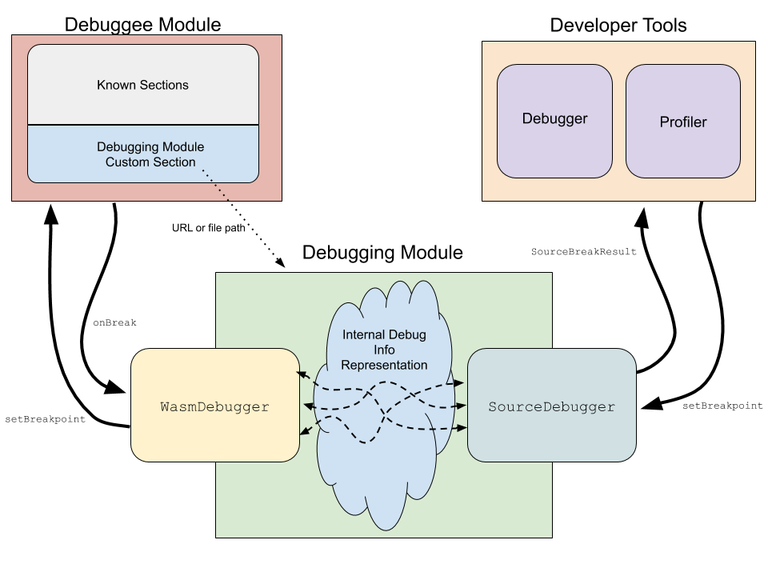

# WebAssembly Debugging Modules

This proposal defines interfaces for querying source-level debugging information
about a WebAssembly module. A WebAssembly runtime can leverage these interfaces
in its developer tools to translate from Wasm-level debugging information into a
user-friendly, source-level presentation.

> **Note:** this is an incomplete, work-in-progress, strawperson proposal!
> Nothing here is set in stone and everything is likely to change!

## Table of Contents

- [Motivation](#motivation)
- [Overview](#overview)
- [Walkthrough](#walkthrough)
- [Interface Definitions](#interface-definitions)
- [FAQ](#faq)

## Motivation

Bugs abound, functions are slow, and developers need to figure out what's
happening and why. But developers aren't typically writing WebAssembly by hand,
they are writing in a high-level source language and compiling it down into
WebAssembly code. Even though the WebAssembly code is what is actually being
executed, developers prefer to debug and profile in terms of the source
language. This source-level experience is the norm for both native code in GDB,
LLDB, or `perf`, and for managed languages in their language-specific tooling,
like JavaScript in a Web browser's developer tools. This proposal aims unlock
the source-level debugging experience for Wasm code running inside a runtime.

> **Note:** This proposal currently only defines APIs that are powerful enough
> to support source-level stepping in a debugger and symbolicating source-level
> locations and function names in other developer tools, such as a profiler or
> logging console.
>
> There are many possible debugging queries that this proposal does not
> currently define APIs for. It does not define APIs for inspecting scopes and
> recovering their bindings' values. It does not define APIs for expanding
> physical Wasm function frames into logical, possibly-inlined source function
> frames. We intend to support these use cases eventually, but are starting with
> just source-level location information, and can incrementally grow the
> debugging module API surface as time goes on.

Additionally, the same way that WebAssembly itself is embedder agnostic, and
doesn't require (for example) a Web browser or JavaScript engine, so too should
debugging functionality be embedder agnostic.

## Overview

This proposal builds on the following existing or proposed WebAssembly concepts:

* **Custom sections:** These are sections defined by the [core WebAssembly
  spec's binary
  format](https://webassembly.github.io/spec/core/binary/modules.html#custom-section)
  whose contents are uninterpreted by the core spec but can be interpreted by
  other tools or specifications (including this proposal)
* **Interface types:** The [WebAssembly interface
  types](https://github.com/WebAssembly/interface-types/blob/master/proposals/interface-types/Explainer.md)
  proposal allows defining shared-nothing, language-neutral interfaces.

This proposal defines the following new concepts:

* **Debuggee module:** A debuggee module is the Wasm module that is being
  debugged or profiled.
* **Debugging module:** A debugging module is referenced from its debuggee Wasm
  module, and is a separate Wasm module that translates between Wasm-level
  debugging information and source-level debuggging information. A debugging
  module is used by the engine's developer tools.
* **`WasmDebugger`:** The `WasmDebugger` interface provides raw, Wasm-level
  debugging APIs for inspecting the debuggee Wasm module. It is implemented by
  the Wasm engine and given to a debugging module's `SourceDebugger` interface.
* **`SourceDebugger`:** The `SourceDebugger` interface provides source-level
  debugging APIs for inspecting the debuggee Wasm module. It is implemented by
  the debugging module, translates between source-level information and
  Wasm-level information, and wraps a `WasmDebugger` instance.
* **Wasm breakpoint:** A breakpoint associated with an instruction in the
  debuggee module's code section.
* **Source breakpoint:** A breakpoint associated with a location in the source
  text, and may map to multiple Wasm breakpoints.

Collectively, these concepts and their relationships can be visualized together
in the following diagram:

## Walkthrough

This section gives high-level walkthroughs of a few representative scenarios
where debugging modules are used by developer tools to provide source-level
information.

### Symbolicating Profiler Stacks

A sampling profiler will periodically pause Wasm execution, record its current
stack, and then resume execution. Each frame in a recorded stack contains the
Wasm module, function, and code offset. To display the profiler's results in a
source-level presentation, the developer tools would perform the following steps
for each frame of each stack:

* Get or instantiate the debugger module `SourceDebugger` for the frame's Wasm
  module.
* Let `sourceRanges` be the result of calling `SourceDebugger.getSourceRanges`.
* If `sourceRanges` is empty, leave the frame unsymbolicated.
* Otherwise, let the frame's source-level symbolication be the first entry of
  `sourceRanges`.

> **Note:** This algorithm and usage of `SourceDebugger.getSourceRanges` enables
> offline stack symbolication. It would not support symbolicating interpreted
> code stacks like C# stacks within Blazor. If we wanted to support
> symbolicating interpreted code stacks, it would likely require calling into
> the debuggee module or inspecting its state online during stack sampling. In
> turn, that would require only sampling at safe points of execution (similar to
> GC safe points) to avoid making intermediate states or optimizations
> observable. This can get a bit hairy, and whether we want to support this or
> not is an open question.

### Listing Sources and Displaying Source Text

Debugger GUIs often display a list of source files or a file and directory tree
of source files. To construct the complete list of source files for Wasm modules
in a runtime, perform the following steps:

* For each debuggee module in the runtime:
    * Get or create the debugging module `SourceDebugger` for the debuggee
      module.
    * Append the result of calling `SourceDebugger.listSources` to the source
      list.

When a user selects a source from the list of all source files, a debugger GUI
will typically display the selected source's text in a tab or panel. The text
for a source can be retrieved by calling `SourceDebugger.getSourceText`.

### Setting a Breakpoint

When a user asks the debugger to set a source-level breakpoint, the debugger
should perform the following steps:

* Get the `SourceDebugger` associated with the breakpoint's source.
* Let `options` be the `SourceBreakpointOptions` describing the requested
  breakpoint.
* Let `id` be the result of calling `SourceDebugger.setBreakpoint` with
  `options`.
    * If there is no expression at the breakpoint's location:
        *  The `SourceDebugger.setBreakpoint` implementation should return null.
    * Otherwise:
        * The `SourceDebugger` implementation should set as many Wasm
          breakpoints as necessary to pause just before evaluation of the
          breakpoint location's expression begins using
          `WasmDebugger.setBreakpoint`.
* If `id` is null:
    * Then no breakpoint was set (e.g because the requested location is within a
      comment) and the UI should reflect this.
* Otherwise:
    * Save the `id` for if/when the breakpoint gets hit or the user wants to
      clear the breakpoint.

### Hitting a Breakpoint

* Let `dbg` be the `SourceDebugger` instance for the current frame.
* Construct the `WasmBreakInfo` for the Wasm breakpoint that was hit.
* Let `breakResult` be the result of calling `dbg.onBreak` with the
  `WasmBreakInfo`
* If `breakResult.kind` is `"Continue"`:
    * Resume the debuggee module's execution.
* Otherwise if `breakResult.kind` is `"Pause"`:
    * Assert that `breakResult.location` is not null.
    * Update the debugger UI to show that execution is paused at the source
      location `breakResult.location`.

### Stepping

* Let `dbg` be the `SourceDebugger` instance for the current frame.
* Construct the `SourceStepOptions` for the step that the user requested.
* Call `dbg.onStep` with the `SourceStepOptions`
    * The `onStep` implementation should use the `WasmDebugger` to set Wasm
      breakpoint(s) where it determines execution should pause after taking the
      requested step.
* Resume debuggee execution.

Pausing after the step has been executed is equivalent to hitting a breakpoint,
as described above, although additionally `SourceDebugger` implementations
should delete any Wasm breakpoints that were created for the step with
`WasmDebugger.clearBreakpoint`.

## Interface Definitions

> **Note:** In order to be embedder agnostic — about whether it is a Web browser
> or JavaScript engine or not — we intend to eventually define these interfaces
> with [WebAssembly Interface
> Types](https://github.com/WebAssembly/interface-types/). However, since that
> standard is still coming together, we are temporarily describing the
> interfaces with Web IDL.

The definitions for interfaces defined in this proposal are available in
[`debugging-modules.webidl`](./debugging-modules.webidl).

## FAQ

### Why not an existing debug info format like DWARF or PDB?

There are a variety of reasons:

* Future extensibility is harder with data formats than interfaces. With
  interfaces, we can always add new, optional methods that debugging modules can
  implement and use or not. With data formats, we need to design future
  extensibility into the format, which requires more care and can also bloat its
  encoded size with repetitive metadata and field tags.

* Interpreting DWARF and PDB data is not straight forward, and the full
  responsibility for that would lie completely on developer tools authors. In
  contrast, debugging modules provide high-level methods for querying program
  information, which are easier to work with for developer tools
  authors. Toolchains can wrap DWARF or PDB interpreters in a debugging module
  interface, and this debugging module implementation can be shared across any
  toolchains that use that same format. Sharing debugging module implementations
  is easier for toolchains than sharing DWARF/PDB interpretation logic is for
  developer tools, since debugging modules talk to a `WasmDebugger` interface
  and produce a well-known `SourceDebugger` interface that are used by all
  toolchains, while developer tools would be calling into internal APIs that
  aren't common across developer tools implementations.

* Both debug info formats and standards ossify and evolve slowly. With debugging
  modules, we allow interface implementations to experiment and iterate
  separately from the standard. This allows innovations (for example more
  compact data representations) to develop and ship without needing to go
  through the slow standards process.

* Static debug info formats don't provide a path forward for source-level
  debugging of projects like Blazor, that run interpreted code inside their
  Wasm. Debugging that interpreted code requires dynamic debugging APIs.

### Why not a protocol instead of Wasm interface types?

A wire protocol requires defining the same set of operations we want to support
that we define as interface methods in this proposal, and *also* a serialization
format. Defining a serialization format that is both compact and
future-extensible is no small task. Additionally, nothing about source-level
debugging *requires* over-the-wire communication or message passing, even if
that is often a good architectural decision. Implementations are free to proxy
this proposal's interface method calls across a protocol or to another
process. It doesn't make sense to bake a specific wire protocol into the
standard, when it can be left as an implementation detail.

One might might be tempted to use a protocol to avoid an inter-standards
dependency on Wasm interface types. A protocol requires passing the serialized
data into and out of the debugging module. Passing that data in or out requires
knowledge of calling conventions and memory ownership (who mallocs and who
frees). This is a problem that Wasm interface types are already standardizing a
solution for, and which engines already intend to support. Duplicating standards
work done by another subgroup is far from ideal: it leads to more implementation
work for both toolchains and engines.

The final thing to consider is the code size impact that using a protocol
implies. Incoming messages must be deserialized and outgoing messages must be
serialized, and both those things require non-trivial amounts of code. On the
other hand, with Wasm interface types most of the functionality is implemented
once in the Wasm engine, and doesn't bloat every module's code size.

### Can debugging modules run outside of the debuggee process?

Yes! Engines are free to run debugging modules in their own process and proxy
calls into `SourceDebugger`, or from `SourceDebugger` to `WasmDebugger`, across
an IPC channel (or even over a wire protocol). However, this is an
implementation detail for the Wasm engine and embedder, and not something that
this proposal needs to standardize.

### What about Wasm that is ahead-of-time compiled into a native library or executable?

This proposal does *not* intend to solve source-level debugging of a native
library or executable that is derived from Wasm that is in turn derived from
some high-level source language. That would most likely be best served by
providing the debugging information in the format that is usually expected for
native code on that platform (e.g. DWARF or PDB) so that all the usual tools for
debugging and profiling native code continue to Just Work without modification.

Theoretically, this proposal could be leveraged in a Source->Wasm->Native
compilation pipeline for translating source-level information into Wasm-level
information, which the compiler then lowers into DWARF or PDB. Even though we
would not ultimately end up with a single debug format for all targets and all
situations, it is expected that a rising tide will lift all boats: some
debugging modules will undoubtedly use DWARF or PDB internally and having shared
tools and conventions for working with Wasm and those formats will help both the
AOT and runtime use cases.
